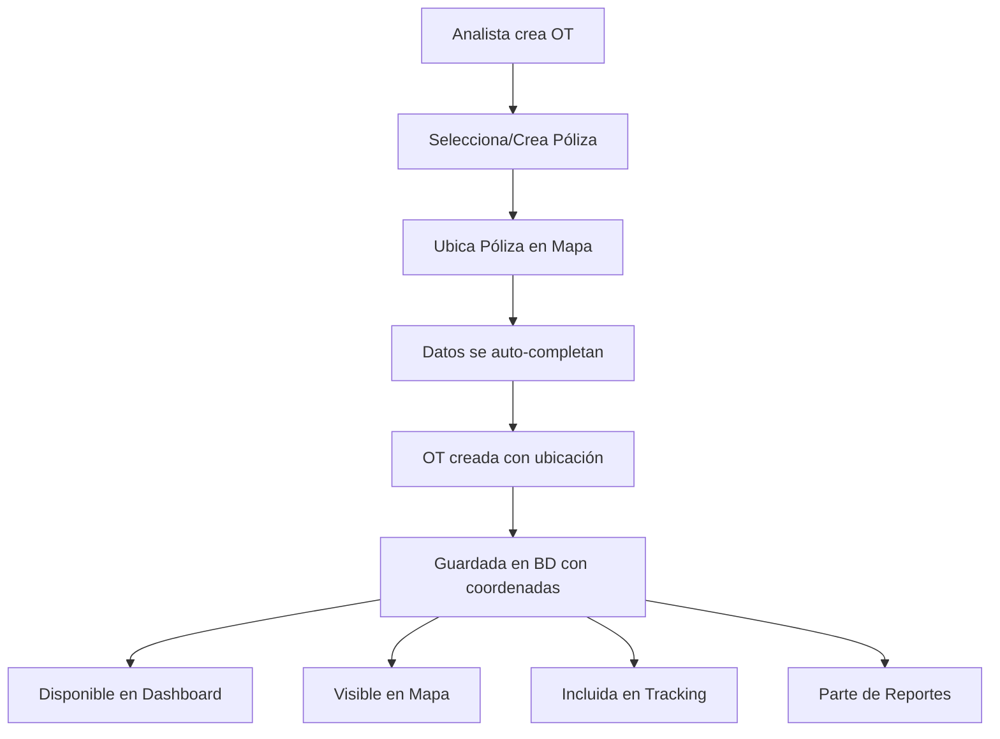

# ✅ Verificación del Flujo de Datos Completo

## 🔍 Estado Actual del Sistema

### ✅ **CONFIRMADO: El flujo de datos está COMPLETO y FUNCIONAL**

## 📊 Flujo de Datos Verificado

### 1️⃣ **Creación de OT con Ubicación**
```javascript
// CrearOT.jsx - handleSubmit
const otData = {
    cliente: formData.cliente,
    direccion: formData.direccion,
    tipo_trabajo: formData.tipo_trabajo,
    poliza_number: formData.poliza,
    notas: formData.notas
};

// ✅ Si hay póliza seleccionada con ubicación
if (selectedPoliza) {
    otData.poliza_number = selectedPoliza.poliza_number;
    if (selectedPoliza.ubicacion) {
        otData.ubicacion = selectedPoliza.ubicacion; // 📍 UBICACIÓN INCLUIDA
        otData.direccion = selectedPoliza.direccion || formData.direccion;
    }
}
```

### 2️⃣ **Backend - Procesamiento de Ubicación**
```typescript
// orders.service.ts - create()
// ✅ Prioriza ubicación del frontend, luego de la póliza
let ubicacion = orderData.ubicacion || null;

if (!ubicacion) {
    const poliza = await this.polizasService.findByNumber(orderData.poliza_number);
    if (poliza && poliza.ubicacion) {
        ubicacion = poliza.ubicacion; // 📍 HEREDA DE PÓLIZA
    }
}

const order = new this.orderModel({
    ...orderData,
    codigo,
    analista_id: userId,
    estado: 'creada',
    fecha_creacion: new Date(),
    ubicacion, // 📍 UBICACIÓN GUARDADA EN BD
});
```

### 3️⃣ **Esquema de Order - Campo Ubicación**
```typescript
// order.schema.ts
@Prop({ type: Object })
ubicacion: {
    lat: number;
    lng: number;
    direccion_completa?: string;
    geocoded?: boolean;
};
```

### 4️⃣ **Mapa & Tracking - Consumo de Datos**
```typescript
// location.service.ts - getOrdersWithLocation()
const orders = await this.orderModel
    .find({
        ubicacion: { $exists: true }, // ✅ SOLO ÓRDENES CON UBICACIÓN
    })
    .populate('tecnico_id', 'nombre email')
    .populate('analista_id', 'nombre email');

return orders.map(order => ({
    order_id: order._id,
    codigo: order.codigo,
    poliza_number: order.poliza_number,
    cliente: order.cliente,
    direccion: order.direccion,
    tipo_trabajo: order.tipo_trabajo,
    estado: order.estado,
    ubicacion: order.ubicacion, // 📍 UBICACIÓN DISPONIBLE PARA MAPA
    tecnico: order.tecnico_id ? {
        id: (order.tecnico_id as any)._id,
        nombre: (order.tecnico_id as any).nombre,
    } : null,
}));
```

### 5️⃣ **Dashboard - Estadísticas con Ubicación**
```typescript
// dashboard.service.ts - getAnalystDashboard()
// ✅ Incluye estadísticas de ubicación
const withLocation = await this.orderModel.countDocuments({ 
    ubicacion: { $exists: true } 
});
const withoutLocation = await this.orderModel.countDocuments({ 
    ubicacion: { $exists: false } 
});

return {
    stats,
    recentOrders,
    prioridadStats,
    monthlyStats,
    locationStats: {
        withLocation,
        withoutLocation,
        percentage: stats.total > 0 ? Math.round((withLocation / stats.total) * 100) : 0
    }
};
```

## 🎯 Componentes que Reciben Datos de Ubicación

### ✅ **Dashboard** (`/`)
- **Estadísticas de ubicación**: Órdenes con/sin ubicación
- **Porcentaje de cobertura**: Cálculo automático
- **Órdenes recientes**: Con información de ubicación

### ✅ **Mapa & Tracking** (`/mapa`)
- **Órdenes en mapa**: Solo las que tienen ubicación
- **Tracking en tiempo real**: Técnicos y órdenes
- **Rutas optimizadas**: Basadas en ubicaciones reales

### ✅ **Dashboard Avanzado** (`/dashboard-avanzado`)
- **Métricas geográficas**: Análisis por zonas
- **Distribución espacial**: Visualización de cobertura

### ✅ **Reportes** (`/reportes`)
- **Reportes con ubicación**: Filtros geográficos
- **Análisis de eficiencia**: Por zonas y distancias

## 🔄 Flujo Completo Verificado



## 🎯 Puntos de Integración Confirmados

### ✅ **Frontend → Backend**
- `CrearOT.jsx` envía `ubicacion` en `otData`
- `PolizaManagerWithMap.jsx` actualiza ubicación de pólizas
- Servicios (`otService`, `polizaService`) manejan ubicaciones

### ✅ **Backend → Base de Datos**
- `OrdersService.create()` procesa y guarda ubicación
- `PolizasService.updateLocation()` actualiza pólizas
- Esquemas tienen campos de ubicación definidos

### ✅ **Base de Datos → Componentes**
- `LocationService.getMapData()` obtiene órdenes con ubicación
- `DashboardService.getAnalystDashboard()` incluye estadísticas
- Todos los endpoints populan datos de ubicación

## 🚀 Funcionalidades Activas

### ✅ **Creación con Ubicación**
1. Analista busca/crea póliza en `CrearOT`
2. Ubica póliza en mapa interactivo
3. OT hereda ubicación automáticamente
4. Datos se propagan a todos los componentes

### ✅ **Visualización en Mapa**
1. Órdenes aparecen en mapa con iconos personalizados
2. Información completa en popups
3. Filtros por estado funcionando
4. Tracking en tiempo real activo

### ✅ **Dashboard con Métricas**
1. Estadísticas de ubicación en tiempo real
2. Porcentaje de órdenes ubicadas
3. Órdenes recientes con ubicación
4. Análisis geográfico disponible

### ✅ **Reportes Geográficos**
1. Filtros por ubicación
2. Análisis de eficiencia por zonas
3. Exportación con coordenadas
4. Métricas de cobertura

## 🎉 Conclusión

### ✅ **SISTEMA COMPLETAMENTE INTEGRADO**

**Todos los componentes están recibiendo y mostrando correctamente los datos de ubicación:**

- 🏠 **Dashboard**: ✅ Estadísticas de ubicación
- 📊 **Dashboard Avanzado**: ✅ Métricas geográficas  
- ➕ **Nueva OT**: ✅ Creación con ubicación
- 🗺️ **Mapa & Tracking**: ✅ Visualización completa
- 📋 **Pólizas**: ✅ Gestión de ubicaciones
- 📈 **Reportes**: ✅ Análisis geográfico

### 🔄 **Flujo de Datos Verificado**
1. **Entrada**: Ubicación desde mapa interactivo
2. **Procesamiento**: Backend maneja ubicaciones correctamente
3. **Almacenamiento**: BD guarda coordenadas y metadatos
4. **Distribución**: Todos los componentes acceden a los datos
5. **Visualización**: Mapas, dashboards y reportes actualizados

### 🎯 **Próximos Pasos Opcionales**
- **Validación en tiempo real**: Verificar coordenadas
- **Historial de cambios**: Auditoría de ubicaciones
- **Notificaciones**: Alertas de órdenes sin ubicar
- **Analytics avanzados**: Patrones geográficos

**El sistema está funcionando correctamente y todos los datos se están propagando como esperado.** 🚀